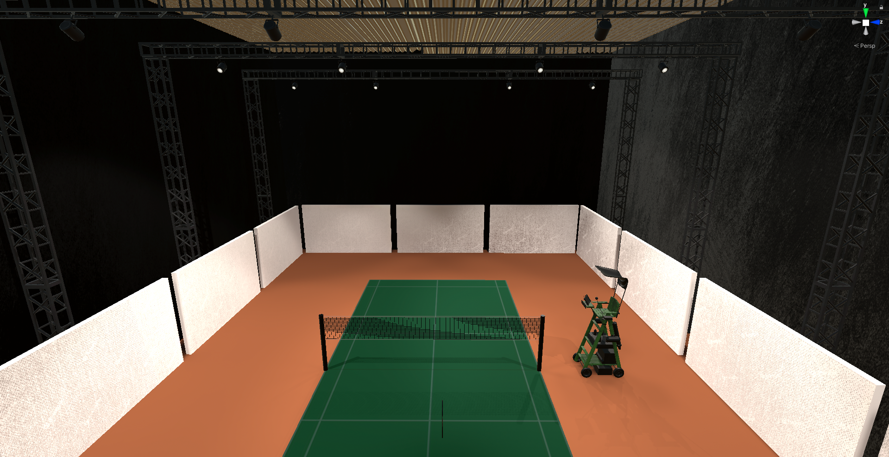

# Temporal Occlusion based Badminton training device.

The simulation is developed using Unity game engine and all the assets were created in Blender. The simulation was deployed on Oculus Quest.

Temporal Occlusion training is used to improve reaction times in badminton players. To train badminton players with for the same, this device runs video clips of an opponent taking badminton shots in two different play modes. In train mode the shuttle is visible and player can observe the opponents posture and develop a mapping to predict the trajectory and speed of the shuttlecock. To aid this learning, the video clips are editied with freeze frames at the point of contact of the shuttle and racquet(temporal occlusion). This learnt skill is put to test mode where the shuttlecocks are invisible and the player must determine solely on the opponent posture the incoming shuttle and hit it. Temporal occlusion is present in both game modes.

The simulation design was done with focus on graphics to reduce cyber sickness. To achieve realsim global illumination and bake lighting was used.

